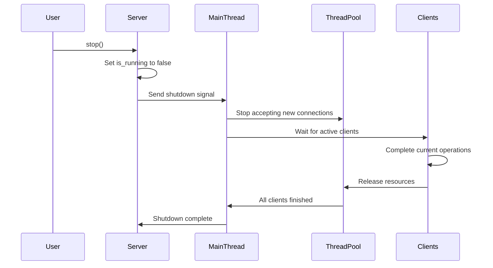

# TCP Server Implementation Analysis & Documentation

## 1. Initial Implementation Issues & Solutions

### 1.1. Shutdown Mechanism
**Bug**: Server would continue running after `stop()` was called
- Initial Implementation: Used only AtomicBool for shutdown signaling
- Root Cause: No proper coordination between main thread and client handlers
- Fix: 
  - Implemented proper shutdown signaling using mpsc channel
  - Added thread joining with timeout
  - Implemented Drop trait for cleanup
  - Added proper client connection termination

### 1.2. Resource Management
**Bug**: Resource leaks in client connections
- Initial Implementation: No explicit cleanup of client connections
- Root Cause: Missing proper connection termination
- Fix:
  - Added Client::shutdown method
  - Implemented proper TCP connection shutdown
  - Added error suppression option for shutdown errors

### 1.3. Client Disconnection Handling
**Bug**: Abrupt client disconnection handling
- Initial Implementation: Immediate disconnection on zero bytes read
- Root Cause: TCP connections might have temporary silent periods
- Fix:
  - Added wait period before closing connection
  - Implemented double-check mechanism for true disconnection
  - Added detailed logging for connection states

## 2. Architectural Improvements

### 2.1. Thread Pool Management
**Initial**: Basic thread creation for each client
**Improved**:
- Implemented proper ThreadPool with fixed size
- Better resource utilization
- Prevented thread explosion under high load

### 2.2. Error Handling
**Initial**: Basic error propagation
**Improved**:
- Comprehensive error handling
- Detailed logging at each step
- Error suppression options where appropriate
- Timeouts for critical operations

### 2.3. State Management
**Initial**: Simple boolean flags
**Improved**:
- Thread-safe state management using Arc<AtomicBool>
- Proper synchronization between threads
- Clear separation of concerns

### 2.4. Connection Management
**Initial**: Basic TCP handling
**Improved**:
- Timeout handling for client operations
- Non-blocking listener with efficient sleep
- Proper connection cleanup
- Buffer size management

## 3. Key Design Patterns Applied

### 3.1. Resource Acquisition Is Initialization (RAII)
- Implemented Drop trait for Server
- Automatic resource cleanup
- Proper handling of server shutdown

### 3.2. Producer-Consumer Pattern
- Using mpsc channel for shutdown signaling
- Thread-safe communication between components

### 3.3. Thread Pool Pattern
- Fixed-size thread pool for client handling
- Efficient resource utilization
- Prevented system resource exhaustion

## 4. Performance Improvements

### 4.1. Non-blocking Operations
- Non-blocking listener
- Efficient sleep intervals
- Proper timeout handling

### 4.2. Resource Utilization
- Fixed buffer sizes
- Controlled number of worker threads
- Efficient thread pool management

## 5. Testing & Reliability
- Added timeout constraints
- Improved error handling and logging
- Better shutdown sequence
- Connection state verification

## 6. Architectural Flow and Sequence

### 6.1. Server Lifecycle

#### Initialization Phase
1. Server Creation:
   - TCP listener binding to specified address
   - Thread pool initialization
   - Shutdown channel creation (mpsc)
   - Atomic flag initialization for running state

2. Server Start-up:
   - `run()` method called
   - Main thread spawned
   - Listener set to non-blocking mode
   - Worker thread pool initialized

#### Operational Phase
1. Main Accept Loop:
   ```
   Main Thread                 Thread Pool                  Client Handlers
   |                              |                              |
   |---(Accept Connections)------>|                              |
   |                              |---(Spawn Client Handler)----->|
   |                              |                              |---(Process Messages)
   |---(Check Shutdown Signal)--->|                              |---(Send Responses)
   |                              |                              |
   ```

2. Client Connection Flow:
   ```
   New Connection --> Client Creation --> Message Processing Loop --> Connection Termination
                            |                     |                          |
                      Set Timeouts         Handle Messages            Cleanup Resources
                                              |
                                    Encode/Decode Protocol Buffers
   ```

3. Message Processing:
   ```
   Read Request --> Decode Message --> Process (Echo/Add) --> Encode Response --> Send Response
        |               |                    |                      |                |
    Check Size     Validate Format     Execute Logic          Prepare Buffer    Flush Stream
   ```

### 6.2. Shutdown Sequence



### 6.3. Resource Management Flow

#### Memory Management
1. Buffer Allocation:
   - Fixed-size buffers per client
   - Stack-allocated for efficiency
   - Controlled cleanup through Drop trait

2. Thread Management:
   ```
   Thread Pool Creation
        |
        |---> Worker Thread 1 ----> Client Handler
        |---> Worker Thread 2 ----> Client Handler
        |---> Worker Thread 3 ----> Client Handler
        |---> Worker Thread 4 ----> Client Handler
   ```

#### Connection States
```
TCP Connection States:
Connected --> Active --> [Processing Messages] --> Disconnecting --> Closed
     |          |               |                       |
     |          |               |                       |
  Set TCP    Create        Handle Client          Cleanup and
  Options    Buffer          Messages             Release Resources
```

### 6.4. Error Handling Flow

1. Hierarchical Error Processing:
   ```
   Error Occurs
       |
       |---> Client Level: Handle connection-specific errors
       |        |---> Retry operation if temporary
       |        |---> Close connection if fatal
       |
       |---> Thread Pool Level: Handle worker thread errors
       |        |---> Log error
       |        |---> Maintain thread pool stability
       |
       |---> Server Level: Handle critical errors
                |---> Log error
                |---> Maintain server stability
                |---> Initiate shutdown if necessary
   ```

2. Recovery Flow:
   ```
   Detect Error --> Log Error --> Attempt Recovery --> Continue/Terminate
        |              |               |                    |
   Classify Error  Record Info    Apply Strategy      Update State
   ```

### 6.5. Communication Patterns

1. Client-Server Interaction:
   ```
   Client                    Server
     |                         |
     |----Echo Message-------->|
     |<---Echo Response--------|
     |                         |
     |----Add Request-------->|
     |<---Add Response---------|
     |                         |
   ```

2. Internal Communication:
   ```
   Main Thread         Worker Threads      Shutdown Channel
        |                   |                    |
        |<------------------)----Status Updates--|
        |                   |                    |
        |---New Clients---->|                    |
        |                   |                    |
        |<-----------------)---Thread Complete---|
   ```

## 7. Future Improvements and Recommendations

### 7.1. Performance Optimization
- Implement connection pooling
- Add configurable buffer sizes
- Optimize protocol buffer serialization/deserialization
- Consider implementing zero-copy operations

### 7.2. Monitoring and Observability
- Add metrics collection
- Implement performance tracing
- Enhanced logging and debugging capabilities
- Health check endpoints

### 7.3. Security Enhancements
- TLS/SSL support
- Authentication mechanism
- Rate limiting
- Connection filtering

### 7.4. Scalability
- Dynamic thread pool sizing
- Load balancing capabilities
- Clustering support
- Connection backpressure mechanisms

### 7.5. Testing
- Expand unit test coverage
- Add integration tests
- Implement stress testing
- Add performance benchmarks

